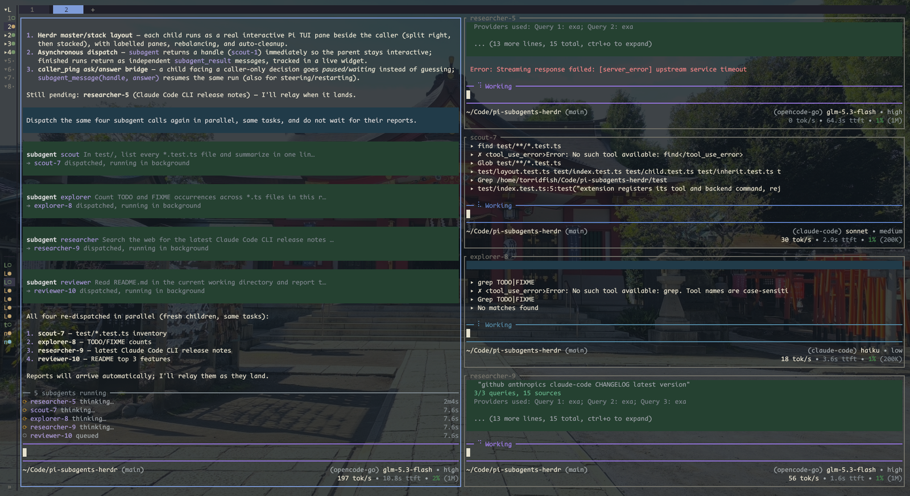

# pi-subagents-herdr


A fork of [amosblomqvist/pi-subagents](https://github.com/amosblomqvist/pi-subagents) with real [Herdr](https://herdr.dev) child panes and a master/stack layout: each child is a real interactive Pi TUI beside the caller (first child splits right, the rest stack down, completion closes and rebalances). Panes are labelled by handle (`scout-2`), not agent type. The caller never shrinks into the stack, and nothing is ever focused, re-tabbed, or rearranged beyond that.

- **Asynchronous dispatch** — `subagent` returns a handle (`scout-1`) immediately; the parent stays interactive. Reports arrive as their own `subagent_result` messages, in finish order.
- **Children can ask** — a child stuck on a caller-owned decision calls `caller_ping` instead of guessing. Its run goes *waiting* (session parked, context held); `subagent_message(handle, answer)` resumes exactly where it stopped.
- **Live progress** — a pinned widget lists in-flight runs with their current tool call and elapsed time; a landed report renders in pi's tool-call block with log, usage and context gauge, `Ctrl+O` for the rest. A subagent's words are never mistaken for the main agent's.
- **One runner, one child process per agent** — see [Runners](#runners). Parent cancellation or shutdown cleans up owned children; a stale heartbeat terminates an orphaned child.
- **Flat topology** — no bundled agent carries `subagent`; the nesting machinery stays dormant unless an agent's frontmatter grants the tool.
- Outside Herdr, `auto` falls back to upstream-style headless JSON subprocesses; a Herdr failure is reported, never silently rerun.

## Install

Requires current Pi (`@earendil-works`, tested with **0.85.1**), Node **22+**, and Herdr with `layout.export` / `layout.set_split_ratio` (API protocol **22**).

```bash
pi install git:github.com/torridfish/pi-subagents-herdr
# Private repository: Git must already be authenticated.
```

Or install a development checkout without copying it: `pi install /absolute/path/to/pi-subagents-herdr`. Run `/reload` or restart Pi. Do not install another extension registering `subagent` alongside this one.

Researcher/worker require **pi-web-access** (`web_search`, `fetch_content`):

```bash
pi install npm:pi-web-access
```

Children inherit your Pi setup (settings, web-search config, renderers, themes) — but tool access is still pinned by the `--tools` allowlist, so inheriting extensions grants no undeclared tool. Tools whose extension the child cannot rediscover (`safe_bash`, anything pinned via `toolExtensions`) are passed explicitly. A missing declared tool fails before launch. `inherit.extensions: false` restores stock-Pi isolation.

## Usage

> 用兩個 scout 同時探索 auth 與 database 模組，最後整合結果。

```json
{ "agent": "scout", "task": "Map the authentication module; report relevant file paths." }
```

The call returns immediately with a handle; there is nothing to wait on or poll. Include all task context explicitly — conversation history is not copied.

| Agent | Purpose | Allowed tools |
|---|---|---|
| scout | Codebase exploration | read, grep, find, ls |
| researcher | Sourced web research | web_search, fetch_content |
| worker | Isolated implementation | read, write, edit, safe_bash, web_search, fetch_content |

Every child also gets `caller_ping`, which no agent declares. `safe_bash` is a heuristic command filter, **not a security sandbox**.

## Asking, and answering

A child that cannot make progress without a decision its caller owns — an ambiguous requirement, a missing credential, a destructive step — calls `caller_ping` rather than guessing. The run goes **waiting**, not finished: the session parks with its context and findings intact, and the question is steered to the parent as a `subagent_question` message naming the handle.

```json
{ "handle": "scout-1", "message": "Leave it in place; a later migration removes it." }
```

It is one run throughout — one process, one handle, one accumulating usage total, one report. A run may ask any number of times; if the answer is the user's to give, the parent is told to ask them.

`subagent_message` covers every way a parent has something more to say:

| Child is | What happens |
| --- | --- |
| **waiting** | The answer is delivered; it carries on from where it stopped |
| **running** | The message is steered into the turn in flight |
| **finished** | The session restarts from its file with the message as the next thing it hears — same context, same handle |

Run directories live as long as the owning Pi session, so a finished child stays addressable; picking it up again is cheaper than rediscovering everything. Internally, process-backend children are driven over `pi --mode rpc` (`prompt` when parked, `steer` mid-turn — pi rejects the wrong one); pane children have the message typed into their pane, the same door a human would use. Nothing blocks on the parent — a parked child is idle, and idle is cheap.

Whether children actually *reach for* the tool is measured, not assumed: `test/eval-ping.ts` (an A/B harness, n=6 per arm) took the ask rate from **1/6 to 5/6** by leading the prompt surface with "prefer asking over guessing" instead of the restrictions. A child that does not ask simply guesses — the floor is the old behaviour, not a worse one.

## Handles across a restart

A settled run is recorded in `~/.pi/subagents-herdr/<project>.json` (`PI_SUBAGENT_STATE_DIR` overrides), and the next session in that directory adopts the handles it finds. An adopted handle is a conversation to resume, never a process to rejoin — after the parent goes there is never a running child: process children exit on stdin EOF, pane children are put down by their watcher after a 20-second stale heartbeat. Retention is a privacy decision (a run directory holds the child's transcript): anything past `retainRunsHours` is deleted at startup before restore. A pane child cannot be adopted — its interactive invocation has no stdin to prompt on — and is refused with a message saying so.

## Stopped, or failed

Four endings, told apart — a model told its child "failed" reaches for a retry, which is the wrong news when somebody pressed Ctrl+C:

| Ending | Reported as |
| --- | --- |
| The user interrupted the turn | `⊘` *Stopped by the user* — plus "do not dispatch again unless they ask" |
| The session ended under the run | `⊘` *Stopped because the session ended* |
| The parent went away without saying so | `⊘` *Stopped because the session went away* |
| The child broke | `✗` *failed*, with what it said |

## Runners

`pi` is the only runner. To run an agent on Claude Code, give it a `claude-code/<model-id>` model and leave it on the pi runner — the [pi-claude-code-provider](https://github.com/torridfish/pi-claude-code-provider) drives a headless `claude -p` behind pi's interface:

```json
{ "models": { "scout": "claude-code/sonnet" } }
```

or `model: claude-code/sonnet` in frontmatter. Model precedence: an explicit `model` argument on the dispatch → per-agent config → `default` config → frontmatter → **the parent session's model** — so an unpinned agent inherits the parent's model. Pin provider agents explicitly.

- The provider is an extension like any other: children load it through your installed pi packages (`inherit.extensions`, on by default). With `inherit.extensions: false` the dispatch is refused up front rather than dying later on an unknown model.
- The id is whatever the installed Claude Code CLI accepts (`sonnet`, `opus`, dated ids, `[1m]` spellings); `anthropic/<id>` is accepted and stripped to the id. `thinking` maps to `--effort`, `off` floored at `low`.
- The child gets the union: claude's own harness tools (built-in read-only Bash set included) plus every declared tool, relayed through the provider and executed by pi as real tool rows. Panes, the ask bridge, `subagent_message` and nested dispatch work unchanged.

(The dedicated `claude` runner this fork once shipped is removed; `runner: claude` is refused with a migration message.)

## Configuration

Copy `config.json.example` to `config.json` beside `index.ts` (gitignored):

```json
{
  "backend": "auto",
  "maxConcurrency": 4,
  "masterRatio": 0.6,
  "minPaneRows": 8,
  "models": {},
  "toolExtensions": {},
  "inherit": { "extensions": true, "skills": false }
}
```

- `backend`: `auto`, `herdr`, or `process`.
- `masterRatio`: master share, 0.2–0.8; applied only when opening the first child. `minPaneRows`: minimum rows per child (default 8) — a full stack fails with a capacity message rather than an unreadable pane.
- `maxConcurrency`: runs per parent process, default 4.
- `models` / `runners`: agent name → model / runner; `default` is the fallback. `runners` accepts only `pi`; `claude` is refused with the migration message.
- `toolExtensions`: tool name → absolute extension path, overriding discovery.
- A second, user-level layer lives at `~/.pi/agent/subagents-herdr.json` (`PI_CODING_AGENT_DIR` honors pi's own override): a shallow merge over this file, top-level key by top-level key. Put the settings that are yours in every project there (which model each agent runs on, for instance) and keep this file for what belongs beside the code; the user-level value wins when both define a key.
- `retainRunsHours`: how long a finished run stays addressable after its session ends (default `168`; `0` reclaims everything at shutdown).
- `inherit.extensions` / `inherit.skills`: load your packages / skills in children (default `true` / `false`). Skills cost context in every child and their tools are allowlist-filtered anyway.

Session-only backend selection: `/subagents-herdr status | herdr | process | auto` — it selects the transport and does not launch a Herdr server; start Pi inside Herdr for pane mode.

Custom agents can register through upstream's `globalThis.__pi_subagents` bridge; see [upstream documentation](docs/UPSTREAM-README.md#registering-agents-from-other-extensions).

## Development and verification

```bash
npm install && npm test && npm run typecheck

# Opt-in, real model usage:
PI_TEST_MODEL=provider/model-id npx tsx test/live-agent.ts     # real child, tool bridging, cleanup
PI_TEST_MODEL=provider/model-id npx tsx test/live-runners.ts   # the same, through subagent
PI_TEST_MODEL=provider/model-id npx tsx test/live-ping.ts      # ask → park → answer → resume
PI_TEST_MODEL=provider/model-id EVAL_N=6 npx tsx test/eval-ping.ts  # ask-rate A/B harness
npx tsx test/live-layout.ts                                    # four panes, focus, rebalancing
```

Unit tests cover ownership boundaries, cross-process serialization, capacity, argument conversion, shell quoting, runner selection, and the pause loop end to end against a stand-in child. Herdr configuration and server versions are never modified. Temporary run files are private (0700/0600); abrupt parent death can leave temp files behind, but the heartbeat stops the child.

## Provenance

Based on upstream history at `1f541897588b995144f0bb8e71a335d1c85b1e62`; layout and transport code are newly implemented, and Herdr execution UX was informed by [0xRichardH/pi-herdr-subagents](https://github.com/0xRichardH/pi-herdr-subagents). This repository is published as a **GitHub fork** of the base repository, history and authorship intact. The base supplies no LICENSE — nothing here is represented as MIT-licensed, and redistribution outside GitHub requires the base author's permission.
